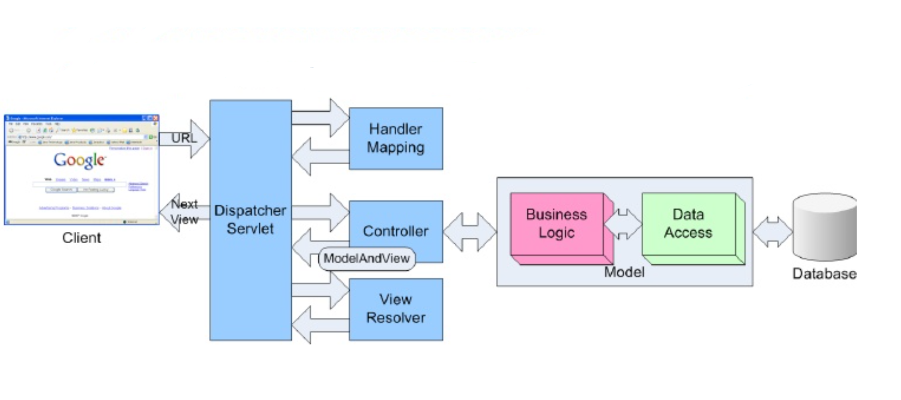
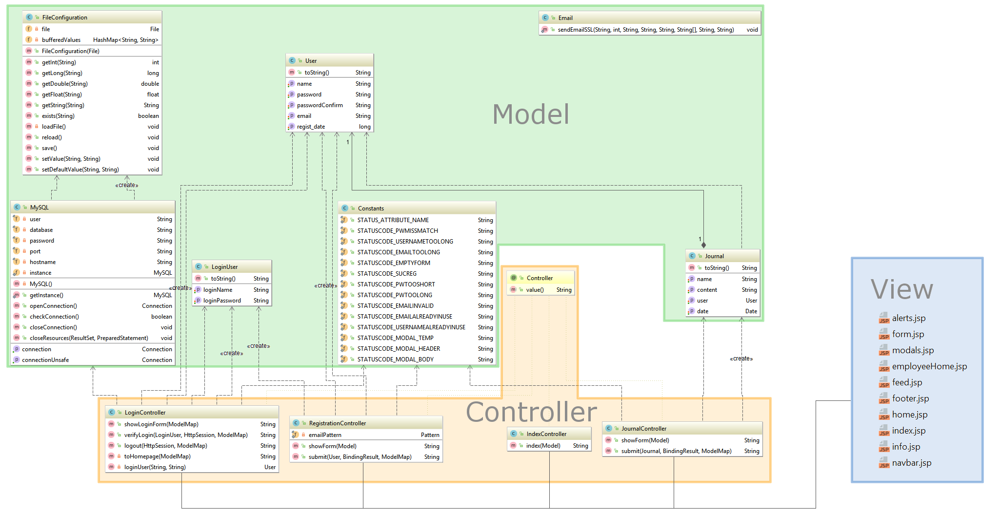
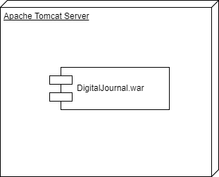
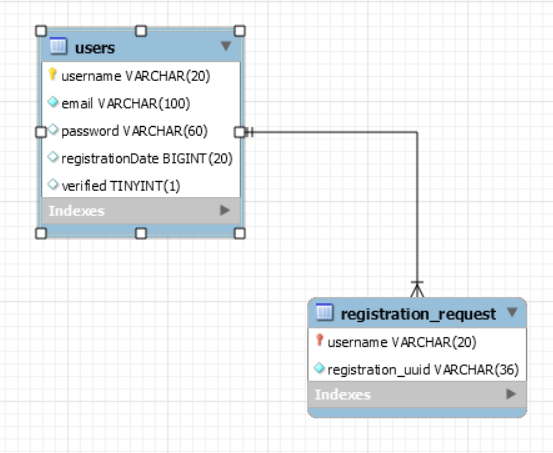

# Software Architecture Document
## 1. Introduction
### 1.1 Purpose
This document provides a comprehensive architectural overview of the system, using a number of different architectural views to depict different aspects of the system. It is intended to capture and convey the significant architectural decisions which have been made on the system.

### 1.2 Scope
The scope of this SAD is to show the architecture of the vnv project. Affected are the class structure, the use cases and the data representation.

## 2. Architectural Representation

In principle, this is the architecture we want to use. Nevertheless, not all of our current classes follow this structure. In fact, we tend to have some BL implemented in Controllerclasses.

## 3. Architectural Goals and Constraints
To have all benefits of the MVC pattern, we decided to use Spring MVC 4.0 as MVC Framework. We are using Spring in the Backend and Frontend. To design our Views, we use Bootstrap, which is not part of this document.

## 4. User-Case View
n/a

## 5. Logical View
We took a look at our Class Diagram and highlighted Model and Controller Classes, aswell as the View JSP Files.

As you can see on the left handside, the view is represented by JavaServer Pages (.jsp). JSP-Files are basically standard HTML5 plus several scripting Tags. The most important one is `<% Content goes here %>`. You can also define other libarys and user further funcionality like if and loops. Another nice feature is the easy partitioning of JSP-Files which we are using e.g. for our footer. 

You may ask yourself what JSP files are. Here's a quick overview:

Java Server Page (JSP) is a technology for controlling the content or appearance of Web pages through the use of servlets, small programs that are specified in the Web page and run on the Web server to modify the Web page before it is sent to the user who requested it. Sun Microsystems, the developer of Java, also refers to the JSP technology as the Servlet application program interface (API). In a nutshell, a Java Server Page calls a Java program that is executed by the Web server.
    
- See http://www.theserverside.com/definition/Java-Server-Page-JSP

## 7. Deployment View

## 8. Implementation View
tba

## 9. Data View
We are using a MySQL database to store user related data. 

