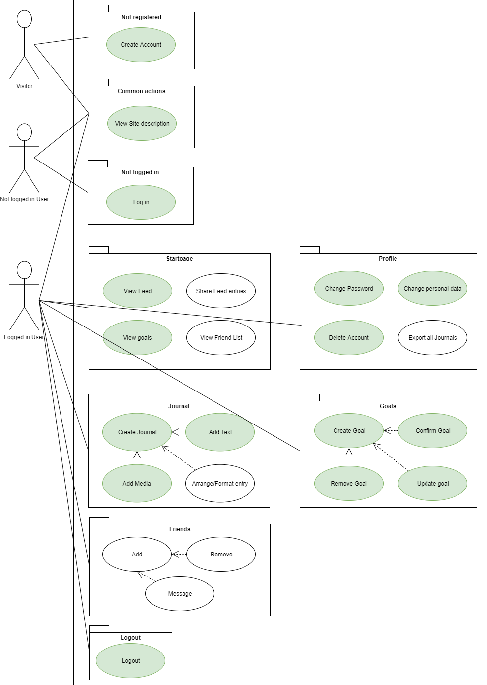

# Digital Journal - Software Requirements Specification

## 1. Introduction
### 1.1 Purpose
This SRS describes all specifications for the DigitalJournal Project by theExcitingCompany. This is a Web-App which allows users to write own journals or diary entries, save them to our secure cloud and access them from everywhere. One is also allowed to share this entries with friends. As our goal is to make peoples life better, we are also going to implement a goal system, where every user can set his own goals and track his way to achieve those. Due to the privacy of those information, we really keep an eye on encryption. 

### 1.2 Scope
The DigitalJournal Project consist of two main parts. The Frontend development, which is done in HTML/CSS as well as JavaScript using _Bootstrap_ and the Backend, using a Model-View-Controller Framework _SpringMVC_ for Java.

### 1.3 Definitions, Acronyms and Abbreviations
* **MVC** Model-View-Controller
* **Twitter-Bootstrap** Web-UI Framework using HTML, CSS and Javascript
* **UC** Use Case
* **UCD** Use Case Diagram
* **SRS** Software Requirements Specification

### 1.4 References
| Title        | Date           |
| ------------- | ------------- |
| [Blog](https://theexcitingcompany.wordpress.com/) | 04.10.2017 | 

## 2. Definition
### 2.1 Vision
Our project is called Digital Journal. The goal of this project is to create a multimedial web based journal that can be accessed from everywhere with internet access. You don’t have to worry about losing your journal ever again.

Functionality: You will be able to create journal entries with pictures and videos which are connected to an account. As a journal is a very private thing security and privacy is a topic we will focus on. However you will be able to share certain journal entries with friends and send them messages if you choose to. To add gamification you will be rewarded with achievements if you reach certain criteria like uploaded 10 images or 20 entries in a row, that also can be shared. You will also be able to create your own goals and start documenting how you reach them.

####The following picture shows the overall use case diagram of our software: 

## 3. Specific Requirements
### 3.1 Functionality
#### 3.1.1 Register Account
The website will provide the possibility to create a new account with which you can access the service. In order to create an account you need a valid email address. 

#### 3.1.2 Login-Page
A page where you can enter your credentials in order to log in.

#### 3.1.3 Start-Page
The start page will give you an overview of you journals entries, as well as your goals. Furthermore it will show you're friend list.

#### 3.1.4 Journal-Entry-Page
This page will give you the opportunity to create a new journal entry for today or edit them. You will be able to write text, include video, audio and pictures as well as some basic formatting. If you are finished you can save and optionally share it with your friends.

#### 3.1.5 Profile-Page
The profile page gives you the opportunity to change your password and maintain your personal information. You can also delete your account.

#### 3.1.6 Goal-Page
This page will give you the opportunity to create a new goal for a certain date and to edit existing goals. If you achieved your goal, you can mark it as complete.

#### 3.1.7 Friend-List
The friend list gives you the opportunity to send messages to your friends and to add/remove friends.

#### 3.1.8 Site description
This page will display some basic information to the project an the website.

### 3.3 Reliability
#### 3.3.1 Server availability
The host we are using is guaranteeing a server uptime of >99%. Do to the fact we are writing an servlet for it the uptime of this webservice might be slightly lower but still above 95%.

#### 3.3.2 MTTR 
Due to this being a student project the time from failure to fix might strongly vary. Downtimes of more than 1 day are possible.

### 3.4 Performance
#### 3.4.1 Responsive Website
Our Website must react responsive to every user input. 
#### 3.4.1 File upload and download
It is also important that file upload (pictures, large text) and download are possible in a short period of time, although we wont be able to guarantee a realtime-communiaction. 

### 3.5 Supportability
#### 3.5.1 Language support
We will use the following languages, which will also be well supported in the future:
* Java SE 8
* W3C internet Standards HTML5, CSS3 
* JavaScript

####3.4.5 Libary support
To build an app according to the MVC architecture, we use _SpringMVC_, which is a common Java Framework.

Our UI Framework is _Bootstrap 4_, which is also very known and will be supported in the future.

### 3.6 Design Constrains
#### 3.6.1 Java Backend
Our Backend should be written in Java 8.

#### 3.7.2 MVC architecture
The whole project should follow the MVC pattern. Therefore, we use Spring as Java Framework.

#### 3.7.3 MySQL database
Generale user information should be saved in a MySQL database, hosted on our own dedicated server.
